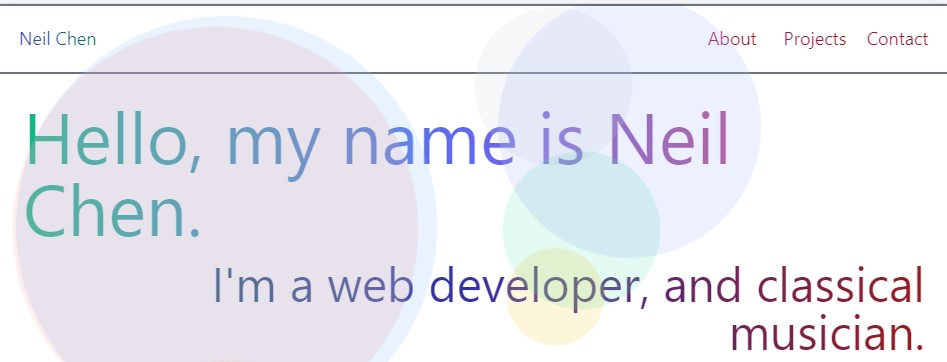
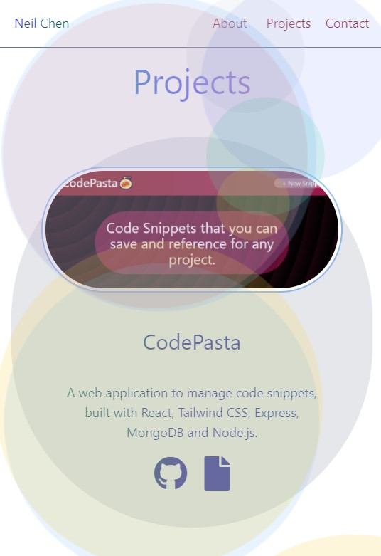

# React Portfolio



## Description

A web portfolio built using [React](https://reactjs.org/), [Tailwind CSS](https://tailwindcss.com/), client side routing using [React Router](https://reactrouter.com/) and bundled with [Snowpack](https://www.snowpack.dev/). Features include:

-   Home, About, Projects and Contact pages
-   Full responsiveness using CSS grid
-   A randomly generated, animation background built using React components, Tailwind CSS utility classes and CSS animations.

A deployed version is linked [here](https://inknsharps.github.io/react_portfolio/#/).

## Installation

To install and test this portfolio locally:

1. Make sure you have [Node.js](https://nodejs.dev/) installed on your local machine.
2. Clone or download this repository, then navigate to the local folder in your CLI, run the following to install all dependencies:

```
    npm install
```

3. Once the dependencies are installed, you can run the following to start a development server:

```
    npm start
```

## Additional Configuration

### Projects Configuration

Each project in the projects page of this web portfolio is an object, and are in a `projects` array, mapped over and added through a function in `src/Project/ProjectContainer/ProjectContainer.jsx`. You can substitute or add entries to the array with your own. Each property of the object must be a string.

```
// src/Project/ProjectContainer/ProjectContainer.jsx

import React from "react";
import ProjectCard from "../ProjectCard/ProjectCard";
import "./ProjectContainer.css";

const ProjectContainer = () => {
    const projects = [
        {
            projectName: "",		// Name
            projectDesc: "",		// Description
            alignImage: "", 		// "left" or "right" to move the image of the project to be left or right aligned
            imageSrc: "", 			// Image link
            githubLink: "", 		// Github link
            deployLink: "" 			// Deployed link
        },
        ...
    ]

    const generateProjects = projects => projects.map(project => <ProjectCard { ...project } />);

    return (
        <main className="ProjectContainer">
            <h2>Projects</h2>
            { generateProjects(projects) }
        </main>
    )
};

export default ProjectContainer;
```

### PurgeCSS Safelist Configuration

Tailwind CSS includes a [PurgeCSS](https://purgecss.com/) version that works specifically with it. Since PurgeCSS only works when the utility classes are explictly stated, any dynamically created classes with concatenation or template literals will not be read (read more about this [here](https://tailwindcss.com/docs/optimizing-for-production#writing-purgeable-html)). A workaround is to make a safelist and pass it into the PurgeCSS configuration. There is some class concatenation in this project, so we have to explicitly tell PurgeCSS to include certain classes. The `safelist.js` file contains some arrays of utility class names that get passed into the `tailwind.config.js` file.

```
// tailwind.config.js
const { colors, coordinates: { top, bottom, left, right }, dimensions: { height, width }, animations } = require("./safelist");

module.exports = {
    purge: {
        content: [
            "./src/**/*.{js,jsx,ts,tsx}",
            "./public/index.html"
        ],
        options: {
            safelist: [ ...colors, ...top, ...bottom, ...left, ...right, ...height, ...width, ...animations ]
        }
    },
...
}
```

### Production Build

Run `npm build` if you want to build a production/optimized version of the application.

## Images



